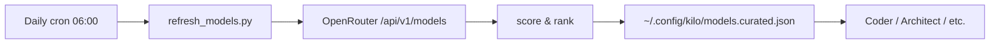

# Rule 01 — Mermaid is required for architectural decisions

Every task that meets ANY of these criteria MUST emit a Mermaid block:

- Introduces a new module, package, or service
- Changes data flow between two or more components
- Adds, removes, or changes an MCP server
- Modifies the agent matrix or model routing
- Changes a public API or schema

The Mermaid block must:

1. Be a valid `flowchart`, `sequenceDiagram`, `stateDiagram-v2`, `classDiagram`, or `erDiagram`.
2. Have a top-of-block comment: `%% title: <one line>` and `%% tags: <comma-separated>`.
3. Be ingested via `mermaid-vector.ingest_mermaid` on task completion.

Pure refactors, formatting fixes, comment-only changes, and dependency bumps are exempt.

## Example

