# kilo-me

<p align="center">
  
</p>

> A self-improving agentic coding workspace for [Kilo Code](https://kilo.ai), powered by **all OpenRouter models** (with Chinese frontier models scored to the top by default and Western frontier variants one `@coder-us` away), with persistent SQLite memory, semantic Mermaid recall via ChromaDB, a relationship graph in embedded Kuzu, an auto-refreshed model catalog, a GitHub-synced best-practices repo, and **per-project cost tracking** via OpenRouter sub-keys provisioned automatically per project. Installed at `~/.kilo-me/` and launched via a `kilo-me` shim on `PATH` — so plain `kilo` keeps Kilo's stock defaults while `kilo-me` opts you into this bundle. Runtime managed by **uv** with **PEP 723 inline scripts** — no venv juggling, no `pip install` rituals.

## Why this exists

Most AI coding setups bind you to one expensive frontier model and forget everything between sessions. This stack flips both:

- It routes work to the best Chinese model for each role by default (Kimi K2.6 for coding, DeepSeek V4 Pro for planning, GLM-5.1 for debugging, Qwen 3.6 Plus for memory curation), but the catalog spans **every** OpenRouter model — and the matching `-us` agents (Claude Opus 4.7, GPT-5.4, Sonnet 4.6, Haiku 4.5, Grok 4.1 Fast) are addressable by name when you want a Western frontier model on demand.
- Every task it runs is logged, indexed semantically, **and graphed** — relationships between prompts, agents, tags, diagrams, and promoted decisions live in an embedded Kuzu graph database alongside the SQLite log and Chroma index. The Memory Curator agent walks that graph to surface prior outcomes during planning.
- If a pattern succeeds repeatedly, it's promoted to a versioned best-practices repo on GitHub.
- **Cost is per-project, not per-account.** `make project-init` mints a dedicated OpenRouter sub-key for each project, agents log per-prompt cost deltas to `USAGE.log.jsonl`, and `make usage-report` rolls the spend up into a project-scoped `USAGE.md`. At wrap-up, `make project-finish` snapshots a final cost banner and (optionally) disables/deletes the key.

## Two ways to run it

| Mode | When | What lives where |
|---|---|---|
| **Global install** (default) | You want Kilo to work the same way in every project | `~/.kilo-me/config/kilo/` — config, agents, MCP servers, memory, embeddings, graph<br/>`~/.kilo-me/data/kilo/auth.json` — credentials (chmod 600, written by `install.sh` on first run)<br/>`~/.kilo-me/state/kilo/model.json` — per-agent model pinning<br/>`~/.local/bin/kilo-me` — wrapper shim that exports XDG_*_HOME and execs `kilo` |
| **Project-local dev** | You're hacking on the stack itself | `<repo>/.kilo/` — same files but project-scoped, plus `.venv/` for tests; secrets in `.env` |

`install.sh` does the global install. `scripts/bootstrap.sh` does the dev one.

> **`kilo` vs `kilo-me`** — vanilla `kilo` reads its own default `~/.config/kilo/` (which this installer leaves alone), so it behaves exactly as Kilo Code ships out of the box. `kilo-me` is a tiny bash shim that points Kilo at `~/.kilo-me/` instead. Pick whichever fits the moment.

## Architecture

```mermaid
%% title: kilo-me with global config + uv + graph memory
%% tags: architecture, overview
flowchart TB
  user([You]) -->|bash install.sh prompts| auth[(~/.kilo-me/data/kilo/auth.json<br/>chmod 600)]
  user -->|kilo-me| shim[~/.local/bin/kilo-me<br/>exports XDG_*_HOME]
  shim --> kilo[Kilo Code]
  kilo -->|reads| cfg[~/.kilo-me/config/kilo/kilo.jsonc]
  kilo -->|via OpenRouter / OpenAI| orapi[(OpenRouter + OpenAI APIs)]

  subgraph agents_ch [Chinese-default lineup]
    arc_ch[architect-ch<br/>DeepSeek V4 Pro]
    cod_ch[coder-ch<br/>Kimi K2.6]
    dbg_ch[debugger-ch<br/>GLM-5.1]
    mc_ch[memory-curator-ch<br/>Qwen 3.6 Plus]
    cf_ch[cheap-fallback-ch<br/>DeepSeek V3.2]
  end
  subgraph agents_us [Western frontier lineup]
    arc_us[architect-us<br/>Claude Opus 4.7]
    cod_us[coder-us<br/>GPT-5.4]
    dbg_us[debugger-us<br/>Claude Sonnet 4.6]
    mc_us[memory-curator-us<br/>Claude Haiku 4.5]
    cf_us[cheap-fallback-us<br/>Grok 4.1 Fast]
  end
  ask[ask<br/>:free models only]
  kilo --> agents_ch & agents_us & ask

  subgraph mcp [MCP servers — uv run with PEP 723 deps]
    sm[sqlite-memory]
    om[openrouter-models]
    mv[mermaid-vector]
    gm[graph-memory]
  end
  agents_ch & agents_us & ask --> sm & om & mv & gm
  om -.->|reads| auth

  sm --> sqlite[(~/.kilo-me/config/kilo/memory.sqlite)]
  mv --> chroma[(~/.kilo-me/config/kilo/chroma/)]
  gm --> kuzu[(~/.kilo-me/config/kilo/graph.kuzu)]
  om --> cache[(~/.kilo-me/config/kilo/models.curated.json)]

  cron[Daily cron 06:00] -.->|uv run| refresh[scripts/refresh_models.py]
  refresh --> cache
  mc_ch & mc_us -->|3+ successes| bp[GitHub kilo-best-practices]

  subgraph project [Per-project cost tracking]
    pi[make project-init] -->|admin /keys POST| orapi
    pkey[(./auth.json<br/>per-project sub-key)]
    pi --> pkey
    pi --> pstate[(./.kilo/project.json)]
    agents_ch & agents_us -->|usage_log.py snapshot| plog[(./USAGE.log.jsonl)]
    rep[make usage-report] -->|admin /keys/hash + log| usagemd[USAGE.md]
    pf[make project-finish] -->|optional disable/delete| orapi
  end
  pkey -.->|inference uses sub-key| orapi
```



## Quickstart — global install

### 1. Prerequisites

- **macOS or Linux** (native).
- **Windows**: use [WSL2](https://learn.microsoft.com/en-us/windows/wsl/install) (`wsl --install` → reboot → Ubuntu) or [Git for Windows](https://git-scm.com/downloads) (provides Git Bash). The installer and MCP servers depend on POSIX paths, `bash`, XDG directories (`~/.config/`, `~/.local/`), and tools like `sqlite3` and `sed`. Run `bash install.sh` *inside* WSL or Git Bash — paths resolve to your WSL/MSYS home, not `C:\Users\...`. Native PowerShell support is on the roadmap, not this milestone.
- Python ≥ 3.10 (for `uv` to bootstrap from)
- Node.js ≥ 18 (for the Kilo CLI)
- An OpenRouter account with credit ([keys page](https://openrouter.ai/keys))

You don't need to install anything else manually — `install.sh` handles uv.

### 2. Install

```bash
git clone <this-repo> kilo-me
cd kilo-me
bash install.sh
```

The installer prompts for two OpenRouter keys (paste them when asked; press Enter to keep existing values on re-runs):

- **OpenRouter API key (inference)** — `sk-or-v1-…`, used by every agent at runtime.
- **OpenRouter management key** — used by `make project-init` to mint per-project sub-keys. Optional, but unlocks per-project cost tracking.

Set `KILO_SKIP_AUTH_PROMPT=1` to skip the prompt (useful for CI). Both keys are written to `~/.kilo-me/data/kilo/auth.json` with `chmod 600`.

That's the whole thing. The installer:

1. Installs `uv` if it's missing.
2. Copies `.kilo/agents/`, `.kilo/rules/`, `mcp_servers/`, and `scripts/` to `~/.kilo-me/config/kilo/`.
3. Renders `~/.kilo-me/config/kilo/kilo.jsonc` with absolute paths.
4. Pre-warms uv's caches (first MCP call would otherwise time out downloading `chromadb` + `sentence-transformers` + `kuzu`).
5. Initializes `memory.sqlite`, `chroma/`, and `graph.kuzu/` under that tree.
6. Patches `~/.kilo-me/state/kilo/model.json` so the per-agent defaults stick.
7. Refreshes the OpenRouter model catalog (skipped if you didn't provide a key — re-run `make refresh-models` later).
8. Drops a `kilo-me` shim at `~/.local/bin/kilo-me`. That's the launch command.

### 3. Verify

```bash
make where             # see where everything lives
make wrapper-status    # confirm the kilo-me shim exists and is on PATH
make auth-status       # confirm auth.json is found and chmod'd correctly
make memory-status     # row count in the SQLite store
make chroma-status     # ChromaDB collection stats
make graph-status      # Kuzu node + edge counts per label
make agent-test        # asks Kilo (via kilo-me) for the top 3 coding models end-to-end
```

### 4. Set up the daily cron

```cron
0 6 * * *  uv run ~/.kilo-me/config/kilo/scripts/refresh_models.py >> ~/.kilo-me/config/kilo/refresh.log 2>&1
0 7 * * *  uv run ~/.kilo-me/config/kilo/scripts/sync_best_practices.py >> ~/.kilo-me/config/kilo/sync.log 2>&1
```

The cron scripts auto-load `~/.kilo-me/data/kilo/auth.json`, so no shell-rc plumbing is required for the daily refresh.

Done. Run `kilo-me` in any project directory and the agents are ready. (`kilo` without the suffix still launches Kilo Code with its stock defaults — the two coexist.)

### Migrating from an older install

Earlier versions of this repo deployed to `~/.config/kilo/` (Kilo's default XDG path) and provided no wrapper. If you're upgrading, the installer leaves the legacy tree in place and prints a migration hint. To move your existing data into the new layout:

```bash
mkdir -p ~/.kilo-me/config ~/.kilo-me/data ~/.kilo-me/state
mv ~/.config/kilo            ~/.kilo-me/config/kilo
mv ~/.local/share/kilo       ~/.kilo-me/data/kilo
mv ~/.local/state/kilo       ~/.kilo-me/state/kilo
```

Then re-run `bash install.sh` to refresh the rendered configs against the new paths. After migrating, plain `kilo` will start fresh against an empty `~/.config/kilo/` (i.e. behave like a new Kilo install) and `kilo-me` will pick up your migrated bundle.

---

## Using Kilo Code with this stack

### Starting a session

The installer wrote `auth.json` for you (or you'll re-run `bash install.sh` to update it). To launch Kilo with this bundle:

```bash
cd ~/my-project
kilo-me
```

`kilo-me` is a thin bash shim at `~/.local/bin/kilo-me` that exports `XDG_CONFIG_HOME=~/.kilo-me/config` (and the data/state equivalents) and exec's `kilo`. Kilo then reads `~/.kilo-me/config/kilo/kilo.jsonc` and merges any project-local `kilo.json` / `kilo.jsonc` over the top.

Plain `kilo` is untouched — it still reads its default `~/.config/kilo/`, giving you Kilo's stock behavior whenever you want it.

---

### Choosing the right agent

Each agent has a specific role. Invoke them by name with `@agent-name` in the Kilo chat. The bare built-in slots (`@architect`, `@code`, `@debug`, `@ask`) point at the `-ch` lineup; use the explicit `-us` names when you want Western frontier models.

| Invoke | Best for |
|--------|----------|
| `@architect-ch` (default) | Planning a new feature, service, or refactor before writing any code. Outputs Mermaid diagram + ADR + task list. Always run this first on non-trivial work. |
| `@architect-us` | Same as above, but on Claude Opus 4.7 for tasks where you want deeper English reasoning. |
| `@coder-ch` (default) | Implementing code, adding tests. Full edit + bash permissions — it will run commands without asking. Auto-creates README + AGENTS + CHANGELOG + TODO on new projects. |
| `@coder-us` | Same as above, on GPT-5.4. |
| `@debugger-ch` (default) | Reproducing a bug, bisecting a regression, reading logs. Read-only — emits a structured diff report, never edits files. |
| `@debugger-us` | Same as above, on Claude Sonnet 4.6. |
| `@memory-curator-ch` (default) | Logs the task to SQLite + Chroma + Kuzu and decides if it's promotion-ready. |
| `@memory-curator-us` | Same as above, on Claude Haiku 4.5. |
| `@cheap-fallback-ch` | Routine edits where cost matters (DeepSeek V3.2). |
| `@cheap-fallback-us` | Routine edits in the Western lane (Grok 4.1 Fast). |
| `@ask` | Read-only Q&A about the codebase or memory. Routes through whichever OpenRouter `:free` model is currently best — never spends paid tokens. |

Example flow for a new feature:

```
@architect-ch  Design an endpoint that exposes the model catalog over HTTP
               → review the plan, approve it

@coder-ch      Implement the plan from the approved ADR
               → runs tests, commits, scaffolds CHANGELOG/TODO if missing

@memory-curator-ch  Log this task and check if it's ready for promotion
                    → writes to SQLite + Chroma + Kuzu graph
```

---

### New project scaffold

When `@coder-ch` (or `@coder-us`) generates a new project it will always create:

- **`README.md`** — project overview, quickstart, design decisions
- **`AGENTS.md`** — agent roster for the project (models, permissions, scope)
- **`CHANGELOG.md`** — Keep-a-Changelog 1.1.0 format with an `## [Unreleased]` section seeded from the initial scaffold
- **`TODO.md`** — pending-work checklist (`- [ ]` lines)

You can also ask explicitly:

```
@coder-ch  scaffold a new FastAPI service called "catalog-api"
```

---

### Checking what the agents remember

```bash
make memory-status      # row count in the SQLite prompt store
make chroma-status      # diagram count in ChromaDB
make graph-status       # node + edge counts in Kuzu, per label
```

Or ask directly inside Kilo:

```
@memory-curator-ch  search memory for "openrouter model ranking"
@ask                what decisions has the graph linked to the "mcp" tag?
```

---

### Switching models mid-session

The model picker in the Kilo TUI lets you switch on the fly. Persistent per-agent defaults live in `~/.local/state/kilo/model.json` — written automatically by `install.sh` but safe to hand-edit:

```json
{
  "model": {
    "code":              { "providerID": "openrouter", "modelID": "moonshotai/kimi-k2.6" },
    "architect-ch":      { "providerID": "openrouter", "modelID": "deepseek/deepseek-v4-pro" },
    "coder-us":          { "providerID": "openai",     "modelID": "gpt-5.4" },
    "ask":               { "providerID": "openrouter", "modelID": "openrouter/free" }
  }
}
```

To let an agent pick its own model based on budget, ask it to call the MCP tool:

```
@coder-ch  use model_for_budget($0.50/Mtok) for this task
```

---

### Refreshing the model catalog

The OpenRouter catalog is cached at `~/.kilo-me/config/kilo/models.curated.json` with a 24h TTL. Refresh manually any time:

```bash
make refresh-models
```

---

### Per-project cost tracking

`kilo-me` ships an end-to-end workflow that gives every project its own OpenRouter sub-key, logs each prompt's cost as a delta, and rolls everything up into a project-scoped `USAGE.md` — so you can answer "what did *this* project cost?" without hunting through account-wide invoices.

#### One-time global setup

The installer prompts for both the inference and the management (provisioning) key on first run, so this is normally already done. To set it manually, your global `auth.json` should look like this:

```jsonc
// ~/.kilo-me/data/kilo/auth.json
{
  "openrouter":           { "type": "api", "key": "sk-or-v1-…INFERENCE…" },
  "OPENROUTER_ADMIN_KEY": "sk-or-v1-…MANAGEMENT…"
}
```

The provisioning key is on Settings → Provisioning Keys at openrouter.ai — it's the only key with `/keys` and `/activity` access. Why flat: the loader maps `"openrouter": {...}` to `OPENROUTER_API_KEY`. A second provider object would collide. Use a flat top-level string for the admin key so it lands in `os.environ` verbatim and the inference key is left alone.

#### Per-project lifecycle

```bash
cd ~/Projects/new-thing

# 1. Provision a per-project sub-key (uses admin key)
make project-init                        # or PROJECT_CREDIT_LIMIT=20 make project-init
# → writes ./auth.json (chmod 600) + ./.kilo/project.json

# 2. Work happens. Agents call:
#      uv run scripts/usage_log.py snapshot --phase start --prompt-id <id> --agent <slug>
#      uv run scripts/usage_log.py snapshot --phase end   --prompt-id <id> --agent <slug>
#    around each prompt (per Rule 04). Both calls hit /keys/{hash} once and append a row
#    to ./USAGE.log.jsonl. The cost of one prompt = end.key_usage − start.key_usage.

# 3. Generate the report any time
make usage-report                        # writes ./USAGE.md
# → Project metadata, project key spend, cost trend, per-prompt costs (by agent + top 10),
#   and the account-wide /activity breakdown for context.

# 4. (Optional) inspect the prompt log directly
make usage-log-summary

# 5. Wrap up
make project-finish                      # snapshots final cost into USAGE.md, marks status=completed
make project-finish DISABLE=1            # also disables the key on OpenRouter (reversible)
make project-finish DELETE=1             # also deletes the key (irreversible)
```

#### Files written into each project

| Path | Written by | Committed? |
|---|---|---|
| `./auth.json` | `project-init` | **No** — gitignored by default |
| `./.kilo/project.json` | `project-init` / `project-finish` | No — gitignored |
| `./USAGE.md` | `usage-report` | Yes — the project-cost ledger |
| `./USAGE.history.jsonl` | every `usage-report` run | No — per-machine snapshot trail |
| `./USAGE.log.jsonl` | every `usage_log.py snapshot` | No — per-machine prompt log |

The script suite (`project_init.py`, `usage_log.py`, `usage_report.py`, `project_finish.py`) auto-loads the global admin key via `mcp_servers/_auth.py`, so the per-project key/hash never has to leave the project folder and the admin key never has to leave `~/.kilo-me/data/kilo/auth.json`.

#### Why it works this way

- `/key` returns the inference key's spend, but inference keys can't see other keys. The admin key + `GET /keys/{hash}` is the only way to get authoritative per-key totals.
- `/activity` is account-wide and exposes no project tag — it's useful for the "where did my month's $$ go" breakdown but can't answer "what did this project cost." The sub-key approach sidesteps that limitation entirely.
- Per-prompt cost deltas come from polling `/keys/{hash}.usage` before and after each agent task — one fast HTTP call per snapshot, no proxying, no scraping `generation_id` from chat-completion responses.

See `.kilo/rules/04-per-prompt-cost-logging.md` for the agent-side convention and the `usage_report.py` docstring for env knobs (`USAGE_REPORT_PATH`, `USAGE_HISTORY_LIMIT`, etc.).

---

### Keeping agents focused on the current project

Drop a `kilo.json` (or `kilo.jsonc`) in your project root to override globals for that project only. Config is deep-merged — only what you set is overridden:

```jsonc
// my-project/kilo.json
{
  "model": "openrouter/moonshotai/kimi-k2.6",
  "agent": {
    "code": { "temperature": 0.2 }
  }
}
```

Project config takes precedence over `~/.kilo-me/config/kilo/kilo.jsonc` when launched via `kilo-me` (see binary docs: remote → global → project → managed).

---

## Credentials and auth.json

For the kilo-me bundle, secrets live at `~/.kilo-me/data/kilo/auth.json` (i.e. `$XDG_DATA_HOME/kilo/auth.json` after the `kilo-me` shim has redirected `XDG_DATA_HOME`) — separate from the config files at `~/.kilo-me/config/kilo/`. This follows the XDG Base Directory spec: configuration is portable, but credentials are sensitive user data with their own permission model.

### Authenticating

`bash install.sh` prompts for the OpenRouter inference and management keys on first run and writes them with `chmod 600`. Re-running the installer keeps existing values (press Enter on a prompt to leave it untouched) or overwrites them if you paste a new value. You can also run `kilo auth login` (Kilo's own flow) at any time — both code paths produce a compatible `auth.json` shape, and the MCP servers will read whichever is present.

### Schema

Kilo's native format (what `kilo auth login` writes), augmented with the optional admin key for per-project cost tracking:

```json
{
  "openrouter":           {"type": "api", "key": "sk-or-v1-...INFERENCE..."},
  "OPENROUTER_ADMIN_KEY": "sk-or-v1-...MANAGEMENT...",
  "BP_REPO_PATH":         "/Users/you/code/kilo-best-practices",
  "BP_REMOTE_BRANCH":     "main",
  "BP_AUTO_MERGE":        "0"
}
```

Provider objects (`{"type": "api", "key": "..."}`) are mapped to `<PROVIDER>_API_KEY` env vars by `mcp_servers/_auth.py` — so `"openrouter".key` becomes `OPENROUTER_API_KEY`. Flat string values are set directly. Both forms can coexist in the same file.

Only `openrouter.key` is required. `OPENROUTER_ADMIN_KEY` is optional but unlocks `make project-init`, `make project-finish`, the authoritative `/keys/{hash}` spend lookup in `make usage-report`, and the account-wide `/activity` breakdown — see [Per-project cost tracking](#per-project-cost-tracking).

### Lookup priority

Every consumer (MCP servers, refresh script, sync script) follows the same precedence:

1. **Existing environment variable** — if `OPENROUTER_API_KEY` is already set in the shell, that wins. The file never overrides shell exports.
2. **`$AUTH_FILE`** — explicit override path. The `kilo-me` shim sets this to `~/.kilo-me/data/kilo/auth.json`.
3. **`$XDG_DATA_HOME/kilo/auth.json`** — the shim points `XDG_DATA_HOME` at `~/.kilo-me/data`, so this resolves to the kilo-me location.
4. **`~/.local/share/kilo/auth.json`** — fallback for plain `kilo` invocations.

This means you can keep a key in your shell rc *and* in auth.json without conflict — shell wins, and removing it from the shell automatically falls through to the file.

### Permissions

`kilo auth login` writes auth.json with `chmod 600`. The loader warns to stderr if it sees anything looser. Don't store auth.json in a directory readable by other users (`chmod 700` on the parent directory is also a good idea — the installer does this).

## How "all OpenRouter models" works

The `openrouter-models` MCP server fetches the **full** model list from `https://openrouter.ai/api/v1/models` (no `category` filter) and ranks all of them with a single weighted score:

| Signal | Weight | Why |
|---|---|---|
| Chinese frontier author (`moonshotai`, `deepseek`, `qwen`, `z-ai`, `xiaomi`, `minimax`, …) | +30 | Chinese frontier models lead price/perf on agentic coding (April 2026) |
| Tool-calling support | +15 / **−25** | Agentic coding without tool calls is broken; missing it is a heavy penalty |
| 1M+ / 200k+ / 128k+ context | +15 / +10 / +5 | Long context wins for memory curation and large refactors |
| Cost (per Mtok output) | 0–20 (inverse) | Cheaper at equal capability is better |
| Reasoning support | +5 | Small bump for plan/debug tasks |

`model_for_budget(task_kind, max_cost_per_mtok, require_chinese)` picks the highest-scoring model that meets your constraints. `top_coding_models()` filters to tool-call-capable ones. `top_free_models()` filters to models with zero pricing or `:free` suffix — that's what the `ask` agent calls at task start. `list_models_by_author("qwen")` lets you browse a specific lab's lineup.

If you want to **restrict** the catalog to a category (e.g., only programming models), set `OPENROUTER_CATEGORY=programming` in your env — the MCP server picks it up automatically.

## How "uv with PEP 723 inline scripts" works

Every MCP server and helper script starts with a metadata block like this:

```python
#!/usr/bin/env -S uv run --script
# /// script
# requires-python = ">=3.10"
# dependencies = [
#   "fastmcp>=0.4.0",
#   "kuzu>=0.4.0",
# ]
# ///
"""server.py — does the thing."""
```

When Kilo invokes the MCP server, the command in `kilo.jsonc` is:

```jsonc
"command": ["uv", "run", "--script", "/Users/you/.kilo-me/config/kilo/mcp_servers/sqlite_memory/server.py"]
```

uv reads the metadata, resolves dependencies into a per-script lockfile, and creates an ephemeral cached venv. Subsequent runs are fast (deps already cached). No global `pip install`, no `requirements.txt` to keep in sync, no venv to activate — and each script's deps are independent, so an upgrade to one doesn't risk breaking another.

For the **dev workflow** (working on the stack itself), there's a `pyproject.toml` with `[project.optional-dependencies] dev` that aggregates everything for testing. `bash scripts/bootstrap.sh` runs `uv pip install -e ".[dev]"` and `uv run pytest`.

## Agent matrix

| Agent | Default model | Role | Edit perms |
|---|---|---|---|
| `architect` (built-in slot) | `deepseek/deepseek-v4-pro` | Same as `architect-ch` | none |
| `code` (built-in slot) | `moonshotai/kimi-k2.6` | Same as `coder-ch` | full |
| `debug` (built-in slot) | `z-ai/glm-5.1` | Same as `debugger-ch` | none, bash only |
| `ask` (built-in slot) | dynamic free model via `top_free_models()` | Read-only Q&A; never paid | none |
| `architect-ch` | `deepseek/deepseek-v4-pro` | Plan-only; ADR + Mermaid | none |
| `coder-ch` | `moonshotai/kimi-k2.6` | Implements code + tests; scaffolds README/AGENTS/CHANGELOG/TODO | full (edit + bash) |
| `debugger-ch` | `z-ai/glm-5.1` | Reproduces, bisects, reports | none, bash only |
| `memory-curator-ch` | `qwen/qwen3.6-plus` | SQLite + Chroma + Kuzu graph; promotes patterns | `docs/decisions/` only |
| `cheap-fallback-ch` | `deepseek/deepseek-v3.2` | Used when `model_for_budget` caps cost | `src/`, `tests/` only |
| `architect-us` | `anthropic/claude-opus-4.7` | Same as `architect-ch`, Western frontier | none |
| `coder-us` | `openai/gpt-5.4` | Same as `coder-ch`, Western frontier | full |
| `debugger-us` | `anthropic/claude-sonnet-4.6` | Same as `debugger-ch`, Western frontier | none, bash only |
| `memory-curator-us` | `anthropic/claude-haiku-4.5` | Same as `memory-curator-ch`, Western frontier | `docs/decisions/` only |
| `cheap-fallback-us` | `x-ai/grok-4.1-fast` | Same as `cheap-fallback-ch`, Western frontier | `src/`, `tests/` only |

The pins are defaults. Any agent can call `openrouter-models.model_for_budget` to pick a different model at runtime.

## MCP servers

Four local stdio servers, all in `mcp_servers/`:

### `sqlite-memory`
Persistent prompt store with FTS5 search. PEP 723 deps: `fastmcp`.

| Tool | Purpose |
|---|---|
| `save_prompt` | Insert/update a task record (idempotent on agent + prompt + day) |
| `search_prompts` | Full-text search over prompts, completions, tags |
| `get_session_history` | All prompts in a session, oldest first |
| `count_pattern` | Count occurrences of a domain tag — drives promotion |
| `record_promotion` | Log a successful promotion to the best-practices repo |

### `openrouter-models`
Auto-refreshed catalog covering **all** OpenRouter models. PEP 723 deps: `fastmcp`, `httpx`.

| Tool | Purpose |
|---|---|
| `refresh_catalog` | Fetch + re-rank from `/api/v1/models` (top 30 cached) |
| `top_coding_models` | Top N by score (with `chinese_only` filter) |
| `top_free_models` | Top N free models (`:free` suffix or zero-priced); used by the `ask` agent |
| `model_for_budget` | Pick the best model under a $/Mtok cap |
| `list_models_by_author` | Show all cached models from one lab |
| `cache_status` | Diagnostic: cache age, freshness, total available |

### `mermaid-vector`
ChromaDB-backed semantic store for architectural Mermaid diagrams. PEP 723 deps: `fastmcp`, `chromadb`, `sentence-transformers`.

| Tool | Purpose |
|---|---|
| `ingest_mermaid` | Embed a diagram + metadata (idempotent on diagram content) |
| `search_diagrams` | Cosine similarity search |
| `similar_decisions` | Filtered semantic search for pre-planning |
| `list_diagrams` | Browse without semantic query |
| `collection_stats` | Diagnostic |
| `delete_diagram` | Prune bad ingests |

### `graph-memory`
Embedded Kuzu graph DB linking prompts ↔ agents ↔ tags ↔ diagrams ↔ decisions ↔ patterns. PEP 723 deps: `fastmcp`, `kuzu`.

| Tool | Purpose |
|---|---|
| `add_node` | Upsert a typed node (`Prompt`, `Agent`, `Tag`, `Diagram`, `Decision`, `Pattern`) |
| `add_edge` | Insert a relationship (`LOGGED_BY`, `TAGGED`, `DEPICTS`, `PROMOTED_TO`, `DERIVES`) |
| `neighbors` | Nodes within N hops (depth clamped to 4) |
| `find_path` | Shortest path between two nodes |
| `cypher` | Escape hatch for arbitrary Cypher reads |
| `stats` | Per-label node count + per-rel edge count |

The Memory Curator agents call `add_node` + `add_edge` after every task so the graph mirrors what the SQLite log records, but with relationship-shaped queries (`find_path`, neighbor traversals) that flat tables can't answer cheaply.

## Promotion to best-practices repo

A pattern graduates to GitHub when:

1. Same primary domain tag appears in **3+** SQLite rows with `success = true`
2. They span at least **2 distinct days**
3. At least one has a Mermaid diagram in `mermaid-vector`

The Memory Curator agent writes a file at `~/.kilo-me/config/kilo/decisions/<kebab-title>.md`. `make sync-bp` (or the cron) pushes it via `gh pr create` to `BP_REPO_PATH`. Promotion writes also create a `Decision` node and a `PROMOTED_TO` edge in the graph store.

## Repo layout

```
kilo-me/                                # repo root
├── install.sh                          # Global installer (deploys to ~/.kilo-me/ + drops kilo-me shim)
├── uninstall.sh                        # Clean removal (preserves user data + auth.json)
├── auth.json.example                   # Template for ~/.kilo-me/data/kilo/auth.json
├── CHANGELOG.md                        # Keep-a-Changelog log of releases
├── TODO.md                             # Active work tracker
├── .kilo/                              # TEMPLATE — installer copies most of this to $KILO_HOME
│   ├── kilo.jsonc                      # __KILO_HOME__ placeholders rendered to abs paths
│   ├── mcp.json                        # Legacy mcpServers schema (compat)
│   ├── agents/                         # One .md per agent (-ch, -us, ask)
│   └── rules/                          # Behavioral rules
├── mcp_servers/
│   ├── _auth.py                        # Shared auth.json loader
│   ├── test_auth.py                    # 11 cases for the loader
│   ├── sqlite_memory/                  # FTS5-backed prompt log
│   ├── openrouter_models/              # imports _auth.py at startup
│   ├── mermaid_vector/                 # ChromaDB
│   └── graph_memory/                   # Kuzu graph
├── scripts/
│   ├── bootstrap.sh                    # DEV: project-local setup
│   ├── refresh_models.py               # PEP 723 cron entry
│   ├── sync_best_practices.py          # PEP 723 git push to BP repo
│   ├── project_init.py                 # Provision per-project OpenRouter sub-key
│   ├── usage_log.py                    # Per-prompt cost snapshots → USAGE.log.jsonl
│   ├── usage_report.py                 # Render USAGE.md (project + cost trend + per-prompt)
│   └── project_finish.py               # Snapshot final cost; optionally disable/delete key
├── docs/
│   ├── adr/                            # Architecture Decision Records
│   └── decisions/                      # Promoted patterns
├── tests/test_smoke.py                 # cross-cutting e2e
├── pyproject.toml
└── Makefile
```

After global install, the runtime layout is:

```
~/.kilo-me/                     # Install root (override with KILO_ME_BASE)
├── config/kilo/                # Code + config (the kilo-me shim points XDG_CONFIG_HOME here)
│   ├── kilo.jsonc
│   ├── mcp.json
│   ├── agents/
│   ├── rules/
│   ├── mcp_servers/
│   ├── scripts/
│   ├── memory.sqlite           # SQLite prompt store
│   ├── chroma/                 # ChromaDB embeddings
│   ├── graph.kuzu/             # Kuzu graph DB
│   ├── models.curated.json     # OpenRouter catalog cache
│   └── decisions/              # Promoted patterns awaiting sync
├── data/kilo/                  # Credentials (XDG_DATA_HOME)
│   └── auth.json               # chmod 600, written by install.sh on first run
└── state/kilo/                 # Per-agent state (XDG_STATE_HOME)
    └── model.json              # Per-agent model pinning

~/.local/bin/kilo-me            # Wrapper shim — exports the XDG_*_HOME triple, exec's kilo
```

`~/.config/kilo/` is intentionally NOT touched by this installer — that directory belongs to vanilla `kilo`, which is left running with Kilo Code's stock defaults.

## Make targets

Run `make help` for the full list. Highlights:

- `make install-global` — deploy to `~/.kilo-me/` and drop the `kilo-me` shim
- `make where` — show all paths (including auth.json and the wrapper)
- `make wrapper-status` — confirm the `kilo-me` shim exists and is on PATH
- `make auth-status` — show which keys are loaded from auth.json
- `make refresh-models` — refresh the catalog
- `make sync-bp` — push promoted patterns to GitHub
- `make memory-status` / `make chroma-status` / `make graph-status` — diagnostics
- `make uninstall` — remove code+config but keep user data
- `make uninstall-purge` — remove everything (including the `kilo-me` shim)

Per-project cost tracking:
- `make project-init` — provision a per-project OpenRouter sub-key (uses admin key)
- `make usage-report` — render `./USAGE.md` (project metadata, key spend, cost trend, per-prompt costs)
- `make usage-log-summary` — print top-N completed prompts by cost from `USAGE.log.jsonl`
- `make project-finish [DISABLE=1|DELETE=1]` — snapshot final cost; optionally clean up the OpenRouter key

For development:
- `make bootstrap` — project-local venv + `.kilo/` for testing
- `make test` — run tests with `uv run pytest`
- `make lint` — `mypy --strict` + `ruff`

## Honest cautions

- **Chinese model tool-calling lags Western models.** DeepSeek V4 Pro occasionally fails in agent runners due to thinking-mode quirks. If your Architect stalls, fall back to `@cheap-fallback-ch` (DeepSeek V3.2) or jump to `@architect-us` (Claude Opus 4.7).
- **Model rankings shift weekly.** The `refresh_models.py` cron is the only thing keeping the catalog from rotting. Put it on a real cron, not a TODO.
- **First MCP call after install is slow.** uv has to download chromadb + sentence-transformers + kuzu (~600MB). `install.sh` pre-warms this — but if you skip the installer, expect a 1–2 minute first invocation.
- **Memory curator costs tokens.** Running it after every task adds latency. To keep it lean, gate it on `success=True` only or batch-flush every 5 turns.
- **Windows is supported under WSL2 / Git Bash only.** Native PowerShell installer isn't shipped yet. If you `bash install.sh` from CMD or PowerShell directly, paths will resolve oddly and the install will fail silently.

## License

MIT — see `LICENSE`.
