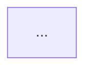

# ADR <num>: <title>

## Context

What problem are we solving? What are the constraints? What changed recently
that made this decision necessary?

## Decision

The chosen approach, in one or two paragraphs. Be concrete: name the libraries,
the components, the data flow.

## Diagram

## Alternatives considered

- **Option A — <name>**. Pros / cons / why rejected.
- **Option B — <name>**. Pros / cons / why rejected.
- **Option C — <name>** (chosen). Why this one wins.

## Consequences

### Positive
- ...

### Negative
- ...

### Neutral
- ...

## Verification

How will we know this decision was correct? What metric, test, or review point
confirms it? When do we revisit?

## Rollback plan

If this turns out to be wrong, what does undoing it cost? What feature flag,
config, or migration handles the reversal?
